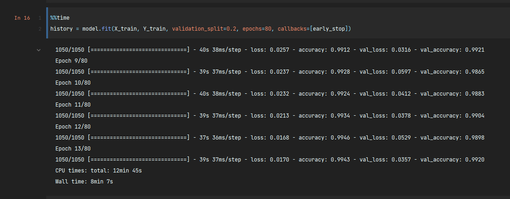
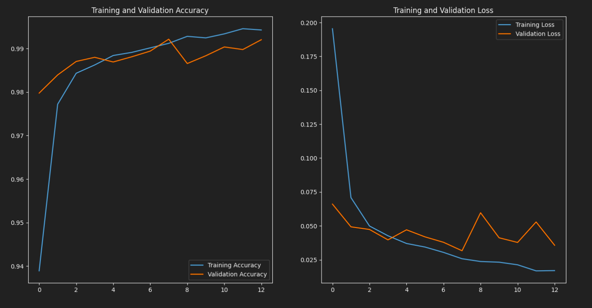
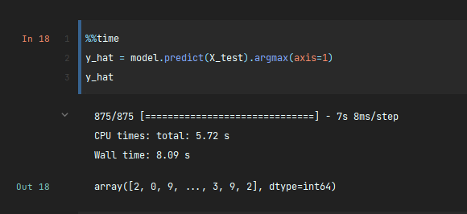

# Digit Classification using the MNIST Dataset

This project uses Tensorflow to build and train a Convolutional Neural Network (CNN) to make predictions on images of 
28 x 28 pixels that contain some unclassified digits. The task of the model is to successfully predict which digit is 
present in each image. To accomplish this, the CNN is trained with a dataset that contains both the pixel values and the 
corresponding labels (numbers) 

## Results
Local training time: 12 mins 45 secs
Hardware:
* CPU: i7 10th gen
* RAM: 16 GB LP-DDR4 3200 
* No discrete GPU used during training

### Training Results

### Prediction Time
